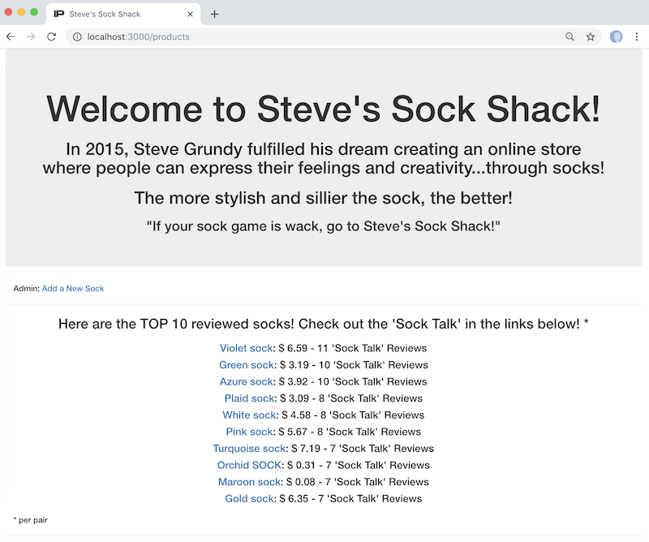
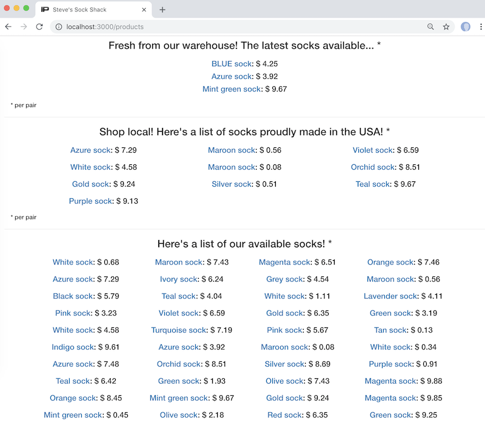

# steves_sock_shack (Steve's Sock Shack)
#### 04/20/2018-04/22/2018

### by Ron Craig (ron.craig@comcast.net)
### GitHub repository: https://github.com/r-craig73/steves_sock_shack

## Description
### A project creating a website for Steve's Sock Shack.  The website uses Ruby on rails to handle products and customer's reviews.

### Sample Home Page (2 different screenshots)
<kbd></kbd>
<kbd></kbd>

### Application instructions (assuming Mac OS)
* If you want to use Postgres for the database and not to install Rail's testing tools, create a file called `.railsrc` in your home directory (using the text editor of your choice) and add the line `-d postgresql -T`

* Clone the repository and direct your terminal into the home repository folder `Computer:steves_sock_shack user$`

* Run `$ gem install rails`

* Verify that you are using ruby-2.4.1 in your terminal(s).

* Run `$ bundle install` to install Ruby gems packages related to the Gemfile in the top level.

* Rspec setup (Unit Testing and Models): In the terminal, run the following command `$ bundle exec rails generate rspec:install`. Files will be generated in the spec folder.  In the home repository folder run `$ rspec` to view tests passing or failing.

* Database setup: Run `rake db:migrate db:test:prepare` to prepare the database and create the Active Record schema.rb file, respectively.

* Starting postgres database system: Run `$ postgres` in a terminal window to start the database.

* Rails server: Run `$ rails server` in a terminal window to start the Rails server.  Navigate to `http://localhost:3000`.  Refresh the page to reload any changes to the source files.

* Integration testing: Use the Capybara gem

## Technologies Used
```
Application: ruby-2.4.1, Bootstrap, HTML, postgres, Rails 5.2.0
Testing: Rspec
Environment: gems
```

* System dependencies

* Configuration


Copyright (c) 2019 **_RC productions_**

## MIT License
-----------
Permission is hereby granted, free of charge, to any person obtaining a copy of this software and associated documentation files (the "Software"), to deal in the Software without restriction, including without limitation the rights to use, copy, modify, merge, publish, distribute, sublicense, and/or sell copies of the Software, and to permit persons to whom the Software is furnished to do so, subject to the following conditions:

The above copyright notice and this permission notice shall be included in all copies or substantial portions of the Software.

THE SOFTWARE IS PROVIDED "AS IS", WITHOUT WARRANTY OF ANY KIND, EXPRESS OR
IMPLIED, INCLUDING BUT NOT LIMITED TO THE WARRANTIES OF MERCHANTABILITY,
FITNESS FOR A PARTICULAR PURPOSE AND NONINFRINGEMENT. IN NO EVENT SHALL THE AUTHORS OR COPYRIGHT HOLDERS BE LIABLE FOR ANY CLAIM, DAMAGES OR OTHER
LIABILITY, WHETHER IN AN ACTION OF CONTRACT, TORT OR OTHERWISE, ARISING FROM, OUT OF OR IN CONNECTION WITH THE SOFTWARE OR THE USE OR OTHER DEALINGS IN THE SOFTWARE.
